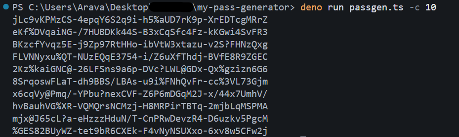

# Passgen - Ultra-Configurable Secure Password Generator

[Francais](#fr---francais) | [English](#en---english)



---

## FR - Francais

### Presentation

**Passgen** est un generateur de mots de passe en ligne de commande, securise et ultra-configurable. Il compile en un **binaire standalone** pour Windows, Linux et macOS — aucune dependance, aucun runtime a installer.

Construit avec [Deno](https://deno.land/) et [TypeScript](https://www.typescriptlang.org/), il utilise le **CSPRNG de l'OS** (`node:crypto`) avec rejection sampling pour eliminer tout biais statistique.

### Pourquoi Passgen ?

- **Mode safe par defaut** — exclut automatiquement les caracteres ambigus (`0O`, `1lI`) et ceux qui cassent les environnements (`$`, `#`, `'`, `` ` ``, `{}`, etc.)
- **Format en blocs** — lisibilite maximale, facile a copier/dicter
- **Mode raw** — acces a tout le charset pour les cas ou on s'en fiche
- **Zero dependance** — un seul binaire, tourne partout
- **Crypto-secure** — CSPRNG + rejection sampling anti-biais modulo

### Modes

#### Mode safe (defaut)

```bash
$ passgen
eEx@++tHsTy-^2A?DRfv7z@-wYSicHfb66c-ChTeh+5mqZk-+rC@
```

- 48 caracteres, blocs de 11 separes par `-`
- Exclut les caracteres ambigus et ceux qui cassent les shells/env/SQL/URLs

#### Mode raw

```bash
$ passgen --raw
W,CasQcrn@C3Y2vQ&1.Ay+/#mEwyk]~a
```

- 32 caracteres, tout le charset, pas de blocs

### Installation

#### Binaires pre-compiles

Telechargez le binaire pour votre plateforme depuis la [page Releases](https://github.com/Arava-0/my-pass-generator/releases) :

| Plateforme       | Binaire                   |
|------------------|---------------------------|
| Windows x64      | `passgen-windows-x64.exe` |
| Linux x64        | `passgen-linux-x64`       |
| Linux ARM64      | `passgen-linux-arm64`     |
| macOS x64        | `passgen-macos-x64`       |
| macOS ARM64 (M1) | `passgen-macos-arm64`     |

```bash
# Linux / macOS
chmod +x passgen-linux-x64
sudo mv passgen-linux-x64 /usr/local/bin/passgen

# Windows — deplacer dans un dossier du PATH
```

#### Depuis les sources

```bash
# Avec Deno installe
deno run passgen.ts

# Compiler en binaire
deno compile --output passgen passgen.ts
```

### Utilisation

```bash
# Defaut : safe mode, 48 chars, blocs de 11
passgen

# 5 mots de passe
passgen -c 5

# Longueur custom
passgen -l 64

# Raw mode (tout le charset, pas de blocs)
passgen --raw

# Raw 64 chars
passgen --raw -l 64

# Sans symboles
passgen -S

# PIN 6 chiffres
passgen -l 6 -U -L -S

# Exclure des caracteres specifiques
passgen --exclude "aeiou"

# Symboles custom
passgen --symbol-set "!@#$"

# Blocs custom (8 chars, separes par ".")
passgen --block-size 8 --block-sep "."
```

### Options

```
Modes:
  (defaut)                Safe mode — 48 chars, blocs de 11 separes par "-",
                          exclut les caracteres ambigus et dangereux
  --raw                   Raw mode — 32 chars, tous les caracteres, pas de blocs

Options:
  -l, --length <n>        Longueur du mot de passe (defaut: 48 safe / 32 raw)
  -c, --count <n>         Nombre de mots de passe (defaut: 1)
  -U, --no-upper          Desactiver les majuscules
  -L, --no-lower          Desactiver les minuscules
  -D, --no-digits         Desactiver les chiffres
  -S, --no-symbols        Desactiver les symboles
      --symbol-set <s>    Jeu de symboles custom
  -x, --exclude-ambiguous Exclure les caracteres ambigus (0O, 1lI, |, `)
      --exclude <s>       Exclure des caracteres specifiques
      --no-require-each   Ne pas exiger un caractere de chaque categorie
      --separator <s>     Separateur entre les mots de passe (defaut: newline)
      --block-size <n>    Decouper en blocs de n caracteres
      --block-sep <s>     Separateur entre les blocs (defaut: "-")
  -h, --help              Afficher l'aide
```

### Securite

| Propriete                | Detail                                                         |
|--------------------------|----------------------------------------------------------------|
| Source d'aleatoire       | CSPRNG de l'OS via `node:crypto.randomBytes()`                 |
| Biais modulo             | Elimine par rejection sampling                                 |
| Charset safe             | Exclut `$#!'"{}()[]|;&<>~` + `.,;:'-_` + ambigus `0O1lI|`\``  |
| Garantie de complexite   | Au moins 1 caractere de chaque categorie activee (par defaut)  |

---

## EN - English

### Overview

**Passgen** is a secure, ultra-configurable command-line password generator. It compiles to a **standalone binary** for Windows, Linux and macOS — no dependencies, no runtime needed.

Built with [Deno](https://deno.land/) and [TypeScript](https://www.typescriptlang.org/), it uses the **OS CSPRNG** (`node:crypto`) with rejection sampling to eliminate any statistical bias.

### Why Passgen?

- **Safe mode by default** — automatically excludes ambiguous characters (`0O`, `1lI`) and those that break environments (`$`, `#`, `'`, `` ` ``, `{}`, etc.)
- **Block format** — maximum readability, easy to copy/dictate
- **Raw mode** — full charset access when you don't care
- **Zero dependency** — single binary, runs everywhere
- **Crypto-secure** — CSPRNG + rejection sampling against modulo bias

### Modes

#### Safe mode (default)

```bash
$ passgen
eEx@++tHsTy-^2A?DRfv7z@-wYSicHfb66c-ChTeh+5mqZk-+rC@
```

- 48 characters, blocks of 11 separated by `-`
- Excludes ambiguous chars and those that break shells/env/SQL/URLs

#### Raw mode

```bash
$ passgen --raw
W,CasQcrn@C3Y2vQ&1.Ay+/#mEwyk]~a
```

- 32 characters, full charset, no blocks

### Installation

#### Pre-built binaries

Download the binary for your platform from the [Releases page](https://github.com/Arava-0/my-pass-generator/releases):

| Platform         | Binary                    |
|------------------|---------------------------|
| Windows x64      | `passgen-windows-x64.exe` |
| Linux x64        | `passgen-linux-x64`       |
| Linux ARM64      | `passgen-linux-arm64`     |
| macOS x64        | `passgen-macos-x64`       |
| macOS ARM64 (M1) | `passgen-macos-arm64`     |

```bash
# Linux / macOS
chmod +x passgen-linux-x64
sudo mv passgen-linux-x64 /usr/local/bin/passgen

# Windows — move to a directory in your PATH
```

#### From source

```bash
# With Deno installed
deno run passgen.ts

# Compile to binary
deno compile --output passgen passgen.ts
```

### Usage

```bash
# Default: safe mode, 48 chars, blocks of 11
passgen

# 5 passwords
passgen -c 5

# Custom length
passgen -l 64

# Raw mode (full charset, no blocks)
passgen --raw

# Raw 64 chars
passgen --raw -l 64

# No symbols
passgen -S

# 6-digit PIN
passgen -l 6 -U -L -S

# Exclude specific characters
passgen --exclude "aeiou"

# Custom symbols
passgen --symbol-set "!@#$"

# Custom blocks (8 chars, separated by ".")
passgen --block-size 8 --block-sep "."
```

### Options

```
Modes:
  (default)               Safe mode — 48 chars, blocks of 11 separated by "-",
                          excludes ambiguous & env-breaking characters
  --raw                   Raw mode — 32 chars, all characters, no blocks

Options:
  -l, --length <n>        Password length (default: 48 safe / 32 raw)
  -c, --count <n>         Number of passwords (default: 1)
  -U, --no-upper          Disable uppercase letters
  -L, --no-lower          Disable lowercase letters
  -D, --no-digits         Disable digits
  -S, --no-symbols        Disable symbols
      --symbol-set <s>    Custom symbol characters
  -x, --exclude-ambiguous Exclude ambiguous chars (0O, 1lI, |, `)
      --exclude <s>       Exclude specific characters
      --no-require-each   Don't require one char from each category
      --separator <s>     Separator between passwords (default: newline)
      --block-size <n>    Split password into blocks of n characters
      --block-sep <s>     Separator between blocks (default: "-")
  -h, --help              Show this help
```

### Security

| Property              | Detail                                                          |
|-----------------------|-----------------------------------------------------------------|
| Randomness source     | OS CSPRNG via `node:crypto.randomBytes()`                       |
| Modulo bias           | Eliminated via rejection sampling                               |
| Safe charset          | Excludes `$#!'"{}()[]|;&<>~` + `.,;:'-_` + ambiguous `0O1lI|`\`` |
| Complexity guarantee  | At least 1 character from each enabled category (by default)    |

---

## License

MIT
